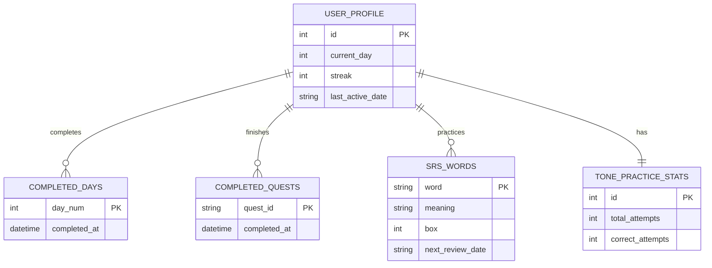

# Database Schema Design — learn-vietnamese

This document outlines the SQLite relational database schema to support persistence for the Vietnamese Language Tutor Web App. The schema will be implemented in Python using **SQLAlchemy ORM**.

---

## 1. Relational Entity Diagram



---

## 2. Table Schemas & DDL

### Table: `user_profile`
Stores global settings and session variables for the local learner.

| Column | Type | Constraints | Description |
|---|---|---|---|
| `id` | INTEGER | PRIMARY KEY, Default: 1 | Local user ID (fixed to 1 for single-user offline app) |
| `current_day` | INTEGER | DEFAULT 1 | Furthest unlocked curriculum day (1-28) |
| `streak` | INTEGER | DEFAULT 0 | Current active streak in days |
| `last_active_date` | VARCHAR(10) | NULLABLE | Date of last activity in `YYYY-MM-DD` |

```sql
CREATE TABLE user_profile (
    id INTEGER PRIMARY KEY DEFAULT 1,
    current_day INTEGER DEFAULT 1,
    streak INTEGER DEFAULT 0,
    last_active_date VARCHAR(10)
);
```

### Table: `completed_days`
Stores which days have been successfully learned.

| Column | Type | Constraints | Description |
|---|---|---|---|
| `day_num` | INTEGER | PRIMARY KEY | The day number completed (1-28) |
| `completed_at` | DATETIME | DEFAULT CURRENT_TIMESTAMP | Date and time of completion |

```sql
CREATE TABLE completed_days (
    day_num INTEGER PRIMARY KEY,
    completed_at DATETIME DEFAULT CURRENT_TIMESTAMP
);
```

### Table: `completed_quests`
Tracks successfully completed roleplay quests.

| Column | Type | Constraints | Description |
|---|---|---|---|
| `quest_id` | VARCHAR(64) | PRIMARY KEY | Unique ID of the quest (e.g. `w1-arrival`) |
| `completed_at` | DATETIME | DEFAULT CURRENT_TIMESTAMP | Date and time of completion |

```sql
CREATE TABLE completed_quests (
    quest_id VARCHAR(64) PRIMARY KEY,
    completed_at DATETIME DEFAULT CURRENT_TIMESTAMP
);
```

### Table: `srs_words`
Stores words currently in the Leitner Spaced Repetition queue.

| Column | Type | Constraints | Description |
|---|---|---|---|
| `word` | VARCHAR(128) | PRIMARY KEY | The Vietnamese word in lowercase |
| `meaning` | VARCHAR(256) | NOT NULL | Thai meaning of the word |
| `box` | INTEGER | DEFAULT 1, CHECK (box BETWEEN 1 AND 5) | Leitner box card is currently in (1 = daily review, 5 = mastered) |
| `next_review_date` | VARCHAR(10) | NOT NULL | Due date for next review in `YYYY-MM-DD` |

```sql
CREATE TABLE srs_words (
    word VARCHAR(128) PRIMARY KEY,
    meaning VARCHAR(256) NOT NULL,
    box INTEGER DEFAULT 1,
    next_review_date VARCHAR(10) NOT NULL
);
```

### Table: `tone_practice_stats`
Tracks lifetime accuracy for the 6-tone practice game.

| Column | Type | Constraints | Description |
|---|---|---|---|
| `id` | INTEGER | PRIMARY KEY | Fixed to 1 |
| `total_attempts` | INTEGER | DEFAULT 0 | Total tone questions answered |
| `correct_attempts` | INTEGER | DEFAULT 0 | Correct answers |

```sql
CREATE TABLE tone_practice_stats (
    id INTEGER PRIMARY KEY DEFAULT 1,
    total_attempts INTEGER DEFAULT 0,
    correct_attempts INTEGER DEFAULT 0
);
```

---

## 3. Seed Data
On database initialization, the backend must seed the `user_profile` and `tone_practice_stats` tables with initial default records if they do not exist:
1.  Insert `user_profile(id=1, current_day=1, streak=0, last_active_date=NULL)`
2.  Insert `tone_practice_stats(id=1, total_attempts=0, correct_attempts=0)`
